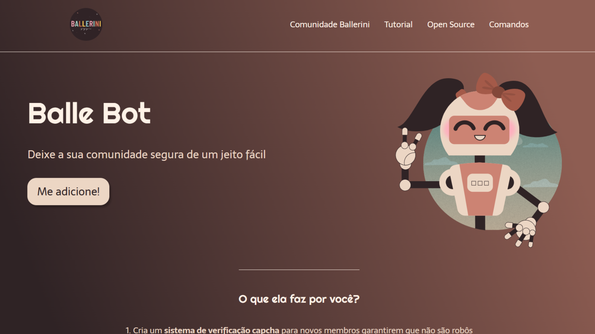

# Balle Bot

## Projeto 💻
Projeto desenvolvido por meio de um vídeo no YouTube do canal da Rafaella Ballerini.
- YouTube: [LANDING PAGE COM HTML e CSS!](https://youtu.be/llF6vD-RljE?si=aaPm5LkW2iU9uB7C)

## Layout 🔖
Segue abaixo o layout deste projeto:
- Figma: [BalleBot](https://www.figma.com/file/myqP66iQwzjwjrIAJyyrip/BalleBot)

## Instalação 🛠
Siga esses passos para instalar o repositório:
1. Rode `git clone https://github.com/dudaishiyama/Balle-Bot` para fazer um clone desse repositório.
2. Abra o arquivo HTML.

## Tecnologias 🚀
As tecnologias utilizadas nesse projeto são:
- HTML
- CSS
- Google Fonts

## Créditos ❤️
Feito por [Duda Ishiyama](https://github.com/dudaishiyama/).